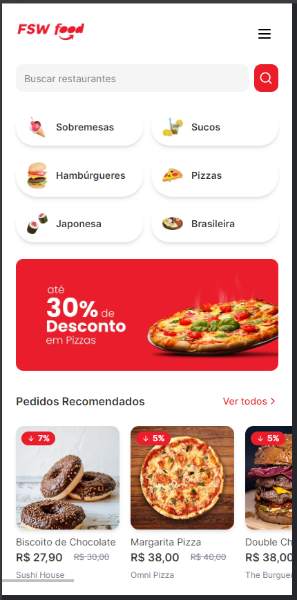
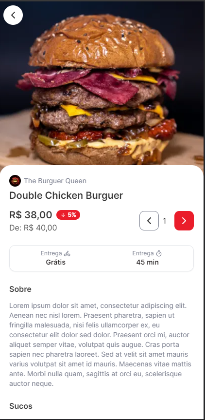

## FSW Food

Essa aplicação foi desenvolvida durante o evento Full Stack Week do dicasparadev.
É uma aplicação FullStack construída com Next é um clone do Ifood com autenticação usando Google e NextAuth.

[Link do projeto](https://fsw-food-teal.vercel.app/)

## Imagens

Página do produto

  

